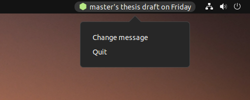
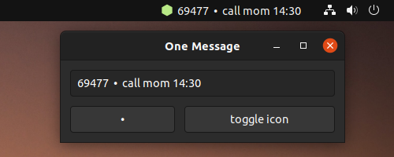

#  One Message

Display your most important message, right in GNOME's system tray. Like a mix between post-it notes and a small todo list.

~Heavily~ Completely inspired by [One Thing](https://sindresorhus.com/one-thing).

## Features

Keeping it simple. Very simple.

- customize and view your one message
- easily add a dot separator (when one thing is too little)
- switch between original and transparent icon (may look cooler)
- no history, no tracking, no nothing

## Installation

A bit manual for now.

- clone the repository
- install libraries `libappindicator3-1` and `libappindicator3-dev`
- edit `Exec` and `Icon` paths in `onemessage.desktop` to match yours
- edit `ICON_FOLDER` in `onemessage` as well
- move the desktop entry file to `~/.local/share/applications`

## Screenshots

